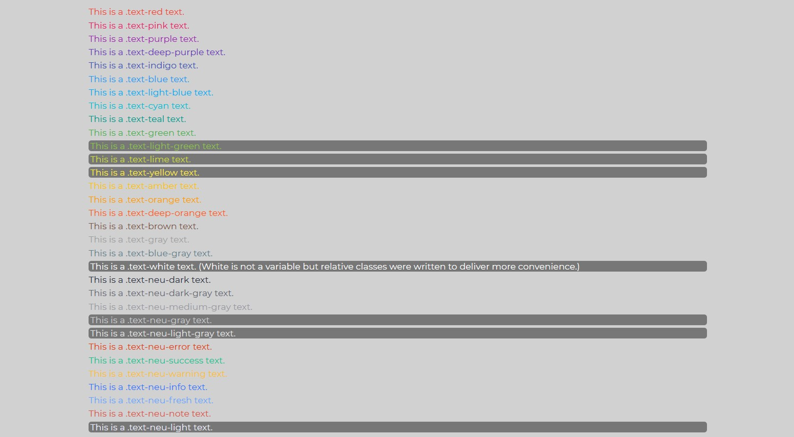
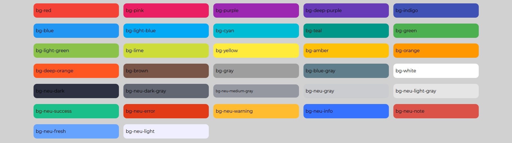
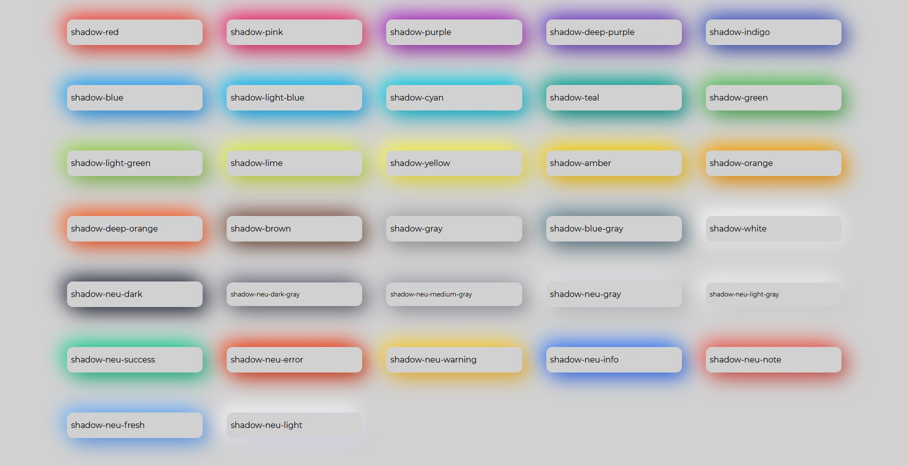
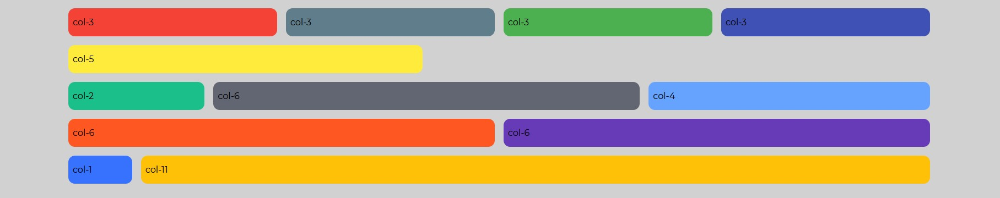
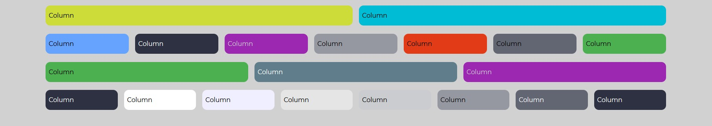

Neux Complete Guide
=============================

This markup page will notify important aspects of neu.css

Important Notes:
----------------
#### 1. Neumorphism is not a new deliverance in this project

The abstract of Neumorphism has been around for quite a time and UI
designers have released many design concepts on multiple platforms like
dribbble.com.

#### 2. Neu.css was built from SASS

Inspired by design concepts and its predecessors, Neu.CSS was written in
SASS. SASS brings pseudo-programming features in writing css including
functions and inheritance.

#### 3. The Neu.css file

This page and other pages' style are based on the compiled css file but
this page discusses the SASS file.

Colors, backgrounds and shadows
-------------------------------

The \_variables.scss file contains of 32 rgba color variables which
includes 19 common Material colors and 13 Neu colors that were extracted
through experience. The defined colors have their own respective text,
background and shadow classes excluding the `neu-tranparent`

Below you can see these colors as text shades and background colors.

Utilizing and adjusters Classes
-------------------------------

Many front-end frameworks include classes to utilize. As other
frameworks, Neu.css intends to let designers skip the curve of creating
responsive and adjustments. To achieve this goal, \_adjusters.scss and
\_adjusters include:

1.  Common display attributes like `.flex` and `.grid`
2.  Couple of classes are written to contain the elements inside;
    `.container` and `.row`.
3.  Two sets of column grid classes have been coded which work with
    containers and rows.
4.  In addition to above, margin and padding adjusters are also
    available: `.5rem`, `1rem`, `2rem`, `3rem`, `4rem`, `5rem`.
5.  Also, up to 8 columns are written from `grid-template-columns` css
    attribute for `display:             grid/ inline-grid` e.g.
    `.grid-columns-3`

#### `.row` associated with `.col-n` (n defers from 1 to 11)

#### `.grid` associated with `.grid-columns-n` (n defers from 2 to 8)

Page Design; A New Approach...
------------------------------

Neumorphism is a new concept in design and inherits the basic
Skeumorphism design aspects but in a more modern way. This neon-like
fresh-looking design, significantly defers from material design provided
by Google. In Neumorphism, everything stands on its parent rather than
float over it. The shadow classes provided in the document are in due to
achieve this goal.

To reach the maximum convenience, all background classes have their own
set of code blocks which provide flat, concave and convex elements with
shadows individually. In addition, `.panel` and `.card` are also
provided. Different inputs are set as `.concave` .
